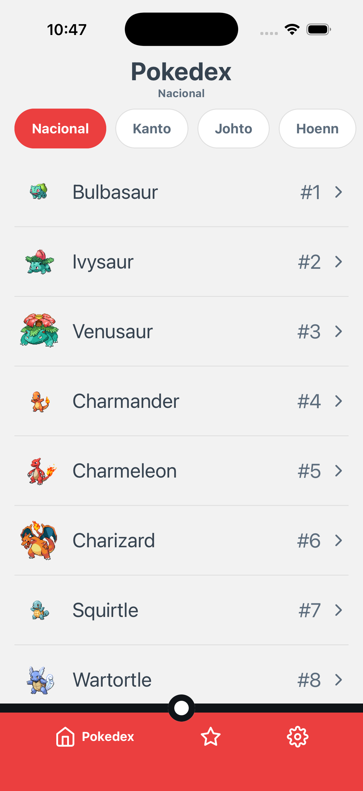
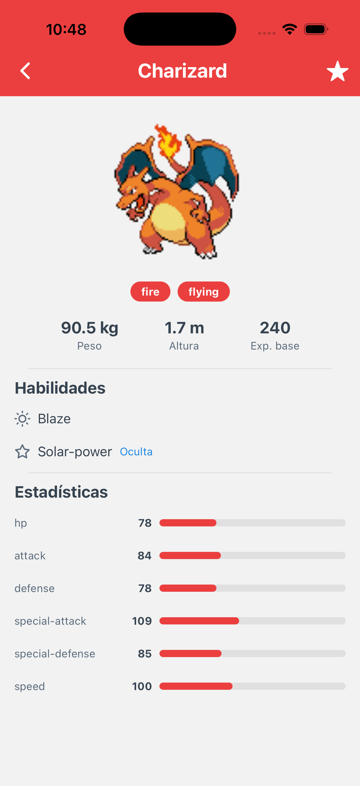

# pokedex-rn-3 · Pokedex Challenge

App móvil de Pokedex en **React Native + TypeScript (Expo)** que consume [PokéAPI](https://pokeapi.co/).
Assessment técnico: listado inicial de pokémon, detalle, persistencia local y arquitectura limpia.

## Demo

| Home | Detalle |
| --- | --- |
|  |  |

## Correr el proyecto

```bash
pnpm install
npx expo start        # abre en Expo Go, simulador iOS o emulador Android
```

```bash
pnpm test             # tests unitarios (dominio, mappers) y de componentes
pnpm typecheck        # TypeScript estricto
pnpm lint             # eslint
```

## Arquitectura

Clean Architecture con tres capas y regla de dependencias hacia el dominio:

```
src/
├── domain/          # Entidades, enums, interfaces de repositorio y casos de uso (sin RN)
├── data/            # PokéAPI (fetch), DTOs + mappers, AsyncStorage, implementaciones
├── core/            # Transversales: errores, DI (composition root), tema, i18n, sesión
└── presentation/    # Navegación, pantallas, componentes y hooks de UI
```

- **Inyección de dependencias**: manual, por constructor, armada una sola vez en el
  composition root (`core/di/container.ts`).
- **Estado**: la regla server/client de mis proyectos en producción — lo que viene del
  servidor vive en **React Query** (fetching, caché, invalidación, reintentos); el estado
  del cliente (tema, idioma) vive en **Zustand** con `persist` + AsyncStorage.
- **Errores**: centralizados en `AppError` (enum de códigos) y traducidos a mensajes
  amigables por i18n. Toda pantalla tiene estados de carga (skeletons), error (con
  reintento) y vacío.

## Persistencia

`AsyncStorage` detrás de una interfaz (`LocalStore`), con estrategia **cache-first + TTL de 24 h**
y fallback a caché vencida si la red falla (experiencia offline parcial):

1. Caché fresca → se usa sin red.
2. Caché vencida o inexistente → se consulta la API y se re-escribe.
3. La red falla pero hay caché → se sirve la caché.

Justificación: los datos de PokéAPI son casi inmutables (TTL largo y seguro) y el volumen es
bajo (páginas de 20 + detalles visitados), por lo que un almacenamiento clave-valor es
suficiente; AsyncStorage fue módulo core de React Native y es el estándar de la comunidad.
Además de la caché, se persisten **datos del usuario**: sus favoritos y sus ajustes
(tema e idioma) — almacenamiento local para datos relevantes, como pide el reto.

## Librerías y justificación

| Librería | Por qué |
| --- | --- |
| `@tanstack/react-query` | Server state: caché, invalidación, reintentos y estados de red; mi stack actual |
| `zustand` (+ `persist`) | Client state (tema, idioma) sin boilerplate; mi stack actual |
| `@react-navigation/*` | Estándar de-facto de navegación |
| `@react-native-async-storage/async-storage` | Persistencia clave-valor; ex-módulo core de RN |
| `expo` (+ `@expo/vector-icons`) | Plataforma permitida por el reto; íconos incluidos en Expo |
| `@testing-library/react-native` (dev) | Tests de componentes centrados en el usuario |

Todo lo demás es React Native puro: `fetch` para red (wrapper propio con timeout),
`Animated` para skeletons/animaciones, i18n y temas hechos a mano.

## Features

- Listado inicial de 20 pokémon (nombre + imagen) con paginación incremental (scroll infinito)
- Filtros por región como chips (Kanto, Johto, …)
- Detalle: tipos, habilidades, estadísticas animadas, peso, altura y experiencia base
- Favoritos persistentes: estrella tipo checkbox en el detalle y tab dedicada
- Modo claro/oscuro con identidad (Pokébola / Ultra Ball) y textos en español/inglés,
  ambos persistentes
- BottomBar de pokébola con animación de tab activa (heredada de mi pokedex de 2021)
- Estados visuales de carga (skeletons), error (con reintento) y vacío
- Mensajes de error centralizados y amigables (en ambos idiomas)
- Accesibilidad: labels/roles/estados para lectores de pantalla, contraste en ambos temas,
  áreas táctiles de 48pt, `allowFontScaling` (respeta el ajuste del sistema) y tamaño de
  texto ajustable desde Ajustes
- Rendimiento: memoización de filas, virtualización con FlatList, caché en memoria y disco
- CI: typecheck + lint + tests en GitHub Actions
- ExampleScreen: laboratorio de desarrollo (peticiones de API con respuesta JSON en vivo
  y galería de componentes), accesible solo en modo dev
 